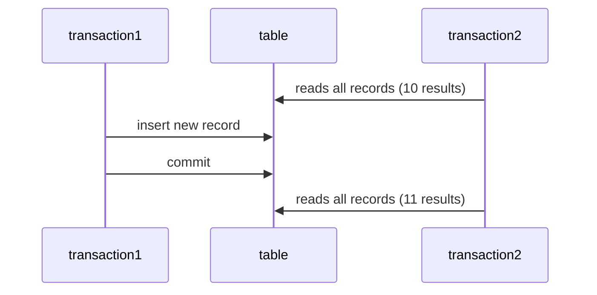
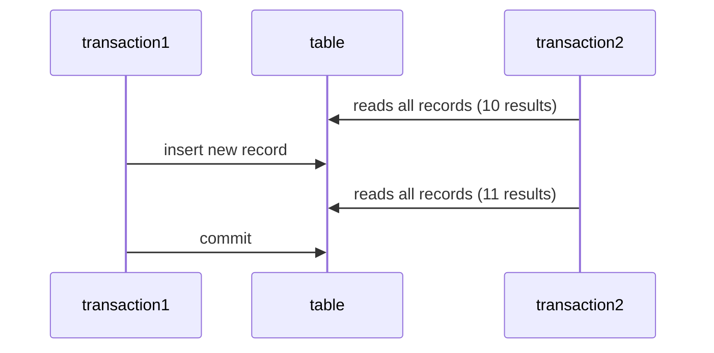

# Database
- This is where we can store information
    - Information in a database "persists" so it is often called a **persistent format**
    - This is why another name for our DAO is a "persistence layer"
    - Benefits to databases are
        - If power goes off, you dont lose all of your stored data
        - As well, it wont be deleted through the stopping and starting of your application (generally)
        - We have a few storage formats
            - Hard disk
            - Magnetic tape
- There a lot of different Dialects of SQL
    - NoSQL
    - MySQL
    - and the one we will be using PostegreSQL

# SQL
- Structured Query Language
    - Programming language for **Relational Databses**
- Please understand, this is not like Java
    - With SQL you run once and what you ran persists
- Most versions of SQL arent case sensitive
    - The names of teh tables and columns are **VERY MUCH** case sensitive
        - You will be using JDBC to "target" these tables and columns, so you need to have good naming conventions and they **need** to match
            - Eg. e_id =/= employee_id and you will just get an error

- SQL errors are terrible and give next to 0 information
    - They are very unhelpful, so coming in with good naming convension, will only help us both!
- ***KEEP YOUR CODE CONSISTENT***

- **Table**
    - **Rows/Records**
        - Horizontal Rows
    - **Columns/attributes**
        - Vertical columns

|associate_id| first_name | last_name | state |
|------------|------------|-----------|-------|
|101|Bill|Billson|New York|
|202|James|Sunderland| Maine|
|303|Hank|Hill|New York|

- As a last note on naming convension, if something is only different by 1 letter, you messed up
    - employeeLoginAuthenticationCheckId //DONT DO THIS
    - employeeLoginAuthenticationIp //THIS IS NOT GOOD NAMING CONVENSION

## Sub Languages of SQL
- **DDL**
  - Commands for creating the **schema**
    - CREATE, DROP, ALTER
    - Schema is a technical term for the structure of your database
      - The tables and columns within those tables
- **DML**
  - Commands for editing the data within the table
    - DELETE, UPDATE, INSERT

## Constraints
- Restrictions we can add to columns on a table
  - **Primary key**
    - combination of two keys Unique and not null
    - Put on a column that serves as a unique identifier for a record.
    - Typically put on a column that represents an ID
  - **Unique**
    - All values withing the column must be unique
  - **NOT NULL**
    - Values cannot null within this column
  - **Check**
    - A conditional that must be met for the column
  - **DEFAULT** 
    - A default value if none is provided
- **Serial**
  - Not really a constraint
  - Does allow you to auto increment
  - Great for IDs

## Normalization
- This is the process of removing redundancy from a database/table
  - This not always a good thing
  - really normalized data can be difficult to work with

### 1NF
- A table has a primary key
  - Each record is uniquely identifiable
- There are no composite columns
  - The data in the column is atomic
  - cannot be broken down into more meaningful colums

denormalized data
|name|salary|
|----|------|
|Lebron James| 26000000|
|Steph Curry| 21000000|
|Steph Curry| 21000000|

normalized data
|id|first_name|last_name|salary|
|--|----------|---------|------|
|101|lebron|James|26000000|
|102|steph| curry| 21000000|
|103|steph| curry| 21000000|

### 2NF 
- A table that follows 1st normalized form
- No column is a **functional dependency**
  - A column cannot be calculated using values in another column

Not in second normalized form
|player_id| shots_attempted | shots_made | shooting_percentage|
|---------|-----------------|------------|--------------------|
|101| 200| 120| 60|

### 3NF
- It's already in 2NF
- No columns are transitive dependencies
  - A column cannot be found in another table

- NOT in 3rd normalized form
  - Puttin Hometown in the player table is redundant

##### Team Table
|team_id| name| hometown| mascot|
|-------|-----|---------|-------|
|101|Muttonchop Mountaineers|Morgantown|The Mountaineer|

##### Player Table
|player_id|fname|lname|hometown|t_id|
|---------|-----|-----|--------|----|
| 888| Adam | Ranieri| Morgantown| 101|

### ACID properties
- Atomic
  - All or none of the statements persist in the transaction
- Consistent 
  - No intermeidarly state where some of the sql statements persisted
- Isolated
  - Transactions can run in parallel
  - Transactions could run in serial
    - One after another and there would be 0 discrepancies ever
- Durable
  - Failures in a transaction do not cause data corruption

### Isolation discrpancies
- Phantom read
  - A transaction reads the same table and finds an extra record the second time from the start of a tranaxction

- Dirty read
  - A transaction reads uncommited data
  - Very few databases actually support this for transactions

